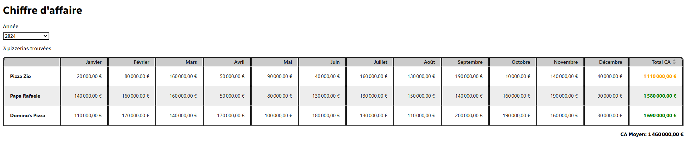
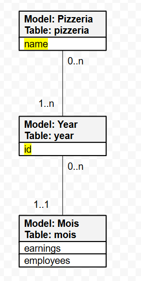

# README

Exercice de mise en situation sur la stack React on Rails. Visuel du projet réalisé:



## Ruby version

    - Ruby 3.3.4

## System dependencies

    - npm 10.8.2
    - node 22.5.1
    - postgresql 14.12 (not used, but might throw an error if you don't have one running)

## Setup

```bash
bundle install
npm i
```

## Database initialization
_I haven't used a database for the realization of the project. But I've added one (postgresql) during the setup steps. Either you remove the dependency to it or run one yourself as well._
```bash
rake db:setup
```


## Run

```bash
./bin/dev
```

## How to run the test suite

_I have issues with the implementation of the test suite. You can find the test file under: `app/javascript/bundles/Pizzerias/components/Pizzerias.test.jsx`_
```bash
npm test 
```

## Data Model


